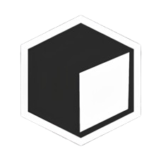

# Prism Terminal

<a id="readme-top"></a>

[![Contributors][contributors-shield]][contributors-url]
[![Forks][forks-shield]][forks-url]
[![Stargazers][stars-shield]][stars-url]
[![Issues][issues-shield]][issues-url]
[![License][license-shield]][license-url]

<div align="center">
  <a href="https://github.com/aditsuru-git/prism-terminal">
    
  </a>
  <h3 align="center">Prism Terminal</h3>

  <p align="center">
    An intelligent terminal with integrated AI chat and command execution capabilities.
    <br />
    <br />
    <a href="https://github.com/aditsuru-git/prism-terminal/issues/new?template=bug_report.yml">Report a Bug</a>
    ·
    <a href="https://github.com/aditsuru-git/prism-terminal/issues/new?template=feature_request.yml">Request a Feature</a>
    ·
    <a href="https://github.com/aditsuru-git/prism-terminal/blob/main/.github/contributing.md">View Contribution Guide</a>
  </p>
</div>

## About The Project

An innovative terminal experience designed to boost developer productivity by integrating modern AI directly into the command-line workflow.

### Built With

[![Python-badge][Python-badge]][Python-url]

<!-- Add your tech stack badges here -->

## Getting Started

### Prerequisites

Make sure you have Python 3.8+ and UV installed on your system.

- Install UV:
  ```sh
  curl -LsSf https://astral.sh/uv/install.sh | sh
  ```

### Installation

1. Clone the repository to your local machine:
   ```sh
   git clone https://github.com/aditsuru-git/prism-terminal.git
   ```
2. Navigate into the project directory and create a virtual environment:
   ```sh
   cd prism-terminal
   python -m venv .venv
   source .venv/bin/activate  # On Linux/macOS
   ```
3. Install the required Python packages using UV:
   ```sh
   uv pip install -r requirements.txt
   ```

## Usage

_For detailed examples and a guide on all available commands, please refer to the [Documentation](link/to/your/docs)._

## Contributing

Contributions are what make the open-source community such an amazing place to learn, inspire, and create. Any contributions you make are **greatly appreciated**.

Before you get started, please take a moment to read our **[Contribution Guide](CONTRIBUTING.md)**. It contains everything you need to know about our workflow, branch naming conventions, and how to submit your work.

## License

Distributed under the MIT License. See `LICENSE` file for more information.

## Acknowledgments

- [Resource Name](https://example.com)
- [Another Resource](https://example.com)

<p align="right">(<a href="#readme-top">back to top</a>)</p>

<div align="center">
  
</div>

<!-- MARKDOWN LINKS & IMAGES -->

[contributors-shield]: https://img.shields.io/github/contributors/aditsuru-git/prism-terminal.svg?style=for-the-badge
[contributors-url]: https://github.com/aditsuru-git/prism-terminal/graphs/contributors
[forks-shield]: https://img.shields.io/github/forks/aditsuru-git/prism-terminal.svg?style=for-the-badge
[forks-url]: https://github.com/aditsuru-git/prism-terminal/network/members
[stars-shield]: https://img.shields.io/github/stars/aditsuru-git/prism-terminal.svg?style=for-the-badge
[stars-url]: https://github.com/aditsuru-git/prism-terminal/stargazers
[issues-shield]: https://img.shields.io/github/issues/aditsuru-git/prism-terminal.svg?style=for-the-badge
[issues-url]: https://github.com/aditsuru-git/prism-terminal/issues
[license-shield]: https://img.shields.io/github/license/aditsuru-git/prism-terminal.svg?style=for-the-badge
[license-url]: https://github.com/aditsuru-git/prism-terminal/blob/main/LICENSE
[Python-badge]: https://img.shields.io/badge/Python-3776AB?style=for-the-badge&logo=python&logoColor=white
[Python-url]: https://www.python.org/
